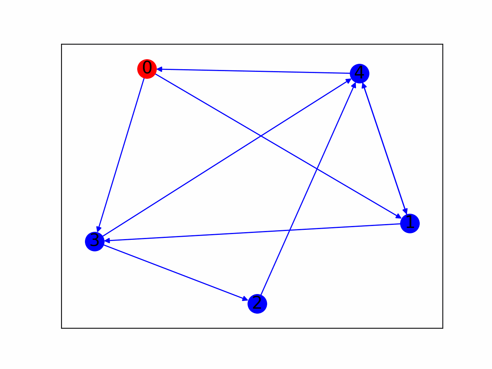

# Trickle-Algorithm

A model and visualization of the Trickle algorithm in Python

Nodes on a graph have a software with a version, they communicate with each other to keep every node up to date

To create an animation, run visual.py

Here is a more complex example with 40 nodes

